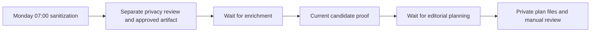

# Final PR #12 cutover proposal

Status: **success-only weekly orchestration is prepared and validated; all
migration workflows remain inactive.** The latest automated cutover plan at the
end of this document supersedes the earlier manual-downstream proposal.
No schedule switch or subworkflow publication has been performed.

## Workflow identities and proposed activation states

| Stage | Retained original ID | Current original state | Replacement ID | Initial cutover state |
| --- | --- | --- | --- | --- |
| Sanitization/privacy v3.1 | `Yjc03gS873IHEJPI` | Active | `IASLinkedinSan01` | Original inactive; replacement active after gates pass |
| Enrichment/recovery v4.7 | `7dhbdbE5Uk0jMbk2` | Inactive | `IASLinkedinEnr01` | Both inactive; replacement run manually |
| Editorial planner v1.6.3 | `on2tXEPsd4eeK6X4` | Inactive | `IASLinkedinPlan1` | Both inactive; replacement run manually |

`up5el6dumwgWkx6i` is the older inactive enrichment v3.2, not the cutover source.
`IASPrivacyReal01` and `IASMountProbe01` are evaluation/probe workflows; they stay
inactive and are not production pipeline stages. Other original workflows,
including active M365/OMC workflows, are outside the change.

## Exact schedule change

The instance uses `America/New_York` for both n8n and process timezone; the three
stage workflows have no timezone override. Preserve this, including daylight-saving
behavior. Output date formatting also remains `America/New_York`.

- Original sanitization: Monday 07:00, cron `0 7 * * 1`. Unpublish/deactivate
  `Yjc03gS873IHEJPI` only after the replacement's controlled cycle succeeds. Keep
  its definition and existing schedule/connection intact for state rollback.
- Replacement sanitization: enable its existing `Weekly Schedule (Mon 7am)` node,
  retain cron `0 7 * * 1`, and connect that node to **`Begin Privacy Attempt`**.
  This differs from the original entry connection to the transcript selector:
  bypassing the new begin node would bypass approval invalidation.
- Original enrichment's Monday 09:00 (`0 9 * * 1`) and original planner's Monday
  10:00 (`0 10 * * 1`) remain stored but inactive. Their replacement schedule nodes
  stay disabled and disconnected. Run enrichment/planning manually after verified
  upstream success. Activating either downstream cron requires a later decision.

The replacement connection to save before publishing is exactly:

```json
{
  "Weekly Schedule (Mon 7am)": {
    "main": [[{"node": "Begin Privacy Attempt", "type": "main", "index": 0}]]
  }
}
```

Use the authenticated n8n UI's native publish/unpublish controls, or its supported
activation API. CLI definition imports prepare inactive workflows; direct database
flag edits are not a runtime scheduling mechanism. No container restart is part of
this cutover.

## Production input/output paths

| Purpose | Container path | Unraid backing path |
| --- | --- | --- |
| Transcript input, read-only | `/data/transcripts/Krisp-API` and `/data/transcripts/Krisp` | `/mnt/user/Shared/Transcripts/Krisp-API` and `/mnt/user/Shared/Transcripts/Krisp` |
| Existing flat output root, retained | `/data/output` | `/mnt/user/Shared/ContentPipeline/output` |
| Replacement production output/helper root | `/data/output/ias-linkedin` | `/mnt/user/Shared/ContentPipeline/output/ias-linkedin` |
| n8n persistent data | `/home/node/.n8n` | `/mnt/app_pool/appdata/n8n/data` |

Both original and replacement transcript selection preserve API-first v0.2.2 rules:
API `started_at`, ten-day window, legacy `mtime`, and duplicate suppression. The
replacement invokes `IAS_TRANSCRIPTS_ROOT=/data/transcripts node
/data/output/ias-linkedin/select-transcripts.cjs`. It does not use staged samples.

The original stages use the following basenames directly under `/data/output`.
The replacements use the same basenames **only under `/data/output/ias-linkedin`**:

- `theme-list-model-eval-qwen35-YYYY-MM-DD.txt`
- `content-brief-model-eval-YYYY-MM-DD.md`
- `content-candidates-model-eval-YYYY-MM-DD.json`
- `linkedin-editorial-plan-model-eval-YYYY-MM-DD.md` and `.json`

Deploy `select-transcripts.cjs`, `privacy-policy.cjs` and `privacy-artifact.cjs` in
the replacement root, with directory mode 0700 and files mode 0600, owned by the
normal n8n UID/GID 1000. Marker commands use
`IAS_PRIVACY_ROOT=/data/output/ias-linkedin`. `privacy-status.json` binds approval
to the current run, exact theme file hash/count, policy version and maximum
24-hour age. Enrichment reads only that approved file and rechecks approval before
all four Brave branches. A failed/pending newer attempt blocks older approval.

The acceptance root `/data/output/ias-linkedin-acceptance` and private real-sample
root `/data/output/ias-linkedin-real-privacy` remain evaluation namespaces. Do not
copy their generated content or approval markers into production. Private bound
exports, source snapshots, logs, output hashes and cutover records remain outside
Git. All model calls retain the existing local LiteLLM `home-chat` route; credentials
are the existing dedicated IAS references. No image, model or context change is
proposed.

## Why 13 of 14 candidates were rejected

The completed source-aware review rejected all thirteen before deterministic
surface validation. Its overlapping flags were: private engagement (13), identifying
context (7), personnel/personal (6), financial/date (5), incident/operations (7),
unsupported topic (5), and identifying combinations (9). Flags describe the model's
source-context judgments, not thirteen proven literal disclosures or independent
measurements of every category.

The sample was selected by word-count heuristics, not as four educational talks.
Nine rejected candidates came from task/status/remediation and commercial/scope
material. Four came from private process/tool choices or inferred benefits lacking
sufficient independently educational explanation. Personal/networking/staffing
material produced no candidates in another sample. A genuine technical principle
survived in the sample that previously produced no themes.

This supports sensitive or insufficiently educational source material as the main
explanation for low yield. The separate local audit found the one surviving theme
useful and grounded, and found no missed safe educational opportunity. It does
**not** prove filtering is never overly restrictive: both reviewers use the same
model, broad source-context flags may overstate categories, and the surface guards
also conservatively exclude acronym/incident-related terms that can be generic
in other contexts. This evidence does not justify weakening those guards or claim
high recall across meetings. Acceptance of the documented same-model/utility limit,
or private human review of the existing evidence, is a deployment decision; no
additional model or sample evaluation is proposed here.

## Diff and secret review

Reviewed the complete PR diff against `main` and compared original node definitions
with the provider/path migration. Additional source-node changes were confined to
the documented extraction/privacy logic and enrichment input/query validation.
Evidence packaging, scoring, exact URL/excerpt checks, source-family requirements,
watchlist exclusion, editorial rules and original execution capabilities were
preserved. New connections place an approval guard before every Brave branch.
The planner still has the inherited three-day input lookback, so its current-cycle
handoff remains an operator check while it is inactive/manual.

Committed exports are inactive, have schedules disabled/disconnected, omit
credential bindings and execution/pinned data, and contain no private transcripts
or generated content. Inline headers contain no authorization values. Secret-pattern
inspection found no keys/tokens/private keys, and the prior private-source-span
scan is recorded in [Readiness.md](Readiness.md). The diff contains no root Compose,
LiteLLM routing or GitHub deployment workflow changes. No review-blocking code or
secret finding was identified. Passed inference/search/privacy tests were not rerun.

## Approval A: merge only, with no service deployment

The existing main-push workflow runs `docker compose pull` and `docker compose up -d`
for LiteLLM; it does not import n8n workflows. For this workflow/docs PR, propose a
squash commit containing `[skip ci]` to avoid that unrelated service reconciliation.
GitHub documents this for `push` workflows in [Skipping workflow runs](https://docs.github.com/en/actions/how-tos/manage-workflow-runs/skip-workflow-runs).
Current review found no required checks/branch rules; recheck repository policy and
head immediately before the approved merge. Do not bypass any newly required check.

After explicit approval, substitute the exact reviewed head SHA:

```bash
gh pr merge 12 --repo rkigara-prog/iggii-ai-stack --squash \
  --match-head-commit APPROVED_HEAD_SHA \
  --subject 'Migrate inactive content pipeline and prepare cutover [skip ci]'
```

Do not enable auto-merge or delete the working branch. Merging stores definitions;
it does not install production profiles or authorize activation.

## Approval B: staged installation and activation

This approval must explicitly cover real-input processing, generic Brave research,
the bounded schedule switch, and the rollback policy below. Prepare profiles from
the merged revision with `prepare-cutover.py`, then bind the dedicated IAS
credentials with `bind.py --source-dir ...`, outside Git. Reuse the three exact
replacement IDs; do not overwrite the retained originals.

1. Save fresh private snapshots of original/replacement definitions, versions,
   active states, timezone and current output metadata. Wait for relevant executing
   workflows to finish; do not terminate them. Check for drift before applying.
2. Create the isolated production root and deploy the three helpers. Import the
   real-input profiles under the replacement IDs while inactive and unscheduled.
3. Run one controlled cycle of these **production profiles**, which has not yet
   been exercised. Run `IASLinkedinSan01`; require successful source-aware review
   and a new approved marker. Review its private evidence locally. If no themes
   survive or any validation fails, stop with the old schedule unchanged.
4. Only after that local pass, run `IASLinkedinEnr01`, then `IASLinkedinPlan1`.
   Require each execution's success and its actual newly written outputs. Record
   the privacy run/hash and generated output hashes privately; confirm the approval
   is still the same after enrichment, the candidates came from that successful
   execution and its approved theme artifact, and the plan used those exact
   candidates. Do not accept an older file merely because it is within three days.
   Preserve evidence checks, watchlist separation, manual webinar review and
   `automaticPublishingAllowed: false`. No post drafting/publishing is permitted.
5. If the controlled cycle passes and activation is expressly authorized, save
   the exact Monday 07:00 connection above in `IASLinkedinSan01`. Unpublish
   `Yjc03gS873IHEJPI`; publish `IASLinkedinSan01`. Confirm exactly one of this pair
   is active, the new schedule enters `Begin Privacy Attempt`, and all enrichment,
   planner, sample/probe workflows remain inactive. Leave downstream stages manual.

No deployment cycle or schedule switch above has been performed by this proposal.
The production-profile cycle is new deployment validation, not a repeat of the
completed synthetic or fixed-sample acceptance checks.

## Rollback and remaining activation blockers

A controlled production-profile cycle is still pending. No outstanding disclosure
or utility finding remains on the repaired four-meeting sample; broader independent
assurance and human acceptance of its limits are not established by that sample.

The retained originals depend on legacy Ollama at
`http://192.168.113.32:11434/api/chat`. The prior readiness inspection found it
unavailable; a single read-only reachability check during proposal review again
received no HTTP response. No legacy service/model was started. Therefore restoring
an original schedule is **configuration rollback, not a guaranteed working inference
fallback**. Before activation, explicitly accept a fail-safe halt when that endpoint
is unavailable, or arrange separately approved legacy service readiness. Do not
start models or disturb the current 128K vLLM deployment to manufacture fallback.

Rollback steps after an approved switch:

1. Unpublish/deactivate `IASLinkedinSan01`; stop initiating manual enrichment or
   planning. Let any in-flight authorized execution finish; do not terminate it.
   Keep `IASLinkedinEnr01` and `IASLinkedinPlan1` inactive.
2. Disable/disconnect the IAS Monday schedule while inactive. Quarantine its
   approval marker and new outputs privately so subsequent manual runs cannot
   consume them. Keep original flat outputs and definitions intact.
3. If legacy inference is available and restoration is authorized, republish the
   retained `Yjc03gS873IHEJPI` with its unchanged Monday 07:00 schedule/connection.
   Original enrichment/planner remain inactive. Confirm one active sanitization
   workflow and no active IAS content workflows.
4. If legacy inference is unavailable, leave both sanitization workflows inactive
   under the approved fail-safe-halt policy and report the blocked fallback. Do not
   silently promise restored generation or launch the legacy models.
5. Restore previous inactive IAS definitions from the private snapshot if needed.
   This rollback affects workflow states/profiles only; the already approved mount
   access fix, existing credentials and inference service configuration are retained.

Before any schedule change, failure/denial simply leaves the original activation
states intact. OMC calendars/messages, publishing, images, backup/monitoring/ASM/
NetBox and additional-model deployment remain outside this cutover.

## Approved attempt — 2026-10-07

PR #12 was squash-merged as `5093a8980fd7dbfd6e3ffd7e2216422d114087ab`
with `[skip ci]`; no deployment workflow run was created. The approved production
profiles and three helpers were installed in the isolated production namespace.
All three replacement workflows remain inactive and unscheduled. Private before/after
snapshots confirm unchanged activation states and unchanged nodes/connections for
the other 27 workflows. Original sanitization remains active. No service restart,
schedule switch, web research, editorial planning or publishing occurred.

The controlled real-input sanitization attempt stopped at `Build Final Public-Safe
Theme List`: **Rejected theme has no policy reason**. The attempt processed 17 meetings. Across 11 review responses
and 61 decisions, three rejected decisions had all risk flags false. These are
internally inconsistent privacy adjudications, not evidence that private content
was disclosed or that the previously repaired four-meeting sample regressed.
The current approval marker remains `pending`; no theme artifact was written.
Enrichment and planning were deliberately not run. Passed acceptance checks were
not repeated, and validation criteria were not relaxed.

The approved gate requires stopping here with the old schedule unchanged. The
remaining content blocker is reliable, complete policy explanations on this
production batch; retain the separate review and fail-closed validation when
remediating it. Private execution evidence is stored under
`/home/node/.n8n/ias-cutover` in the persistent n8n data directory and
`/tmp/ias-cutover` on Unraid, outside Git.

A separate access prerequisite for the eventual native schedule switch is missing:
this instance has no native n8n API key. An owner-authorized key with workflow
read/update/activate/deactivate access was requested via a mode-0600 host file
`/mnt/app_pool/appdata/n8n/data/ias-cutover-api-key`, never chat. It was absent
at the final check. This access alone does not clear the privacy gate. No native
activation operation or direct database flag edit was attempted.

## Targeted privacy repair — 2026-10-07

The user authorized resolving the privacy gate while leaving schedules unchanged.
The private native API key is now installed with mode 0600 and authenticated
workflow reads succeeded. Its value was neither displayed nor added to Git.

Inspection of all cached reviews located the three inconsistent decisions in
**one** five-candidate batch. All three marked `educational=false` but every
risk flag false. The review instructions did not explicitly connect absent
educational support to `unsupported_topic`; the correction makes that mapping
and the existing nonempty rejection-reason requirement explicit. The same rule
is documented in query review. No validator or acceptance criterion changed.
Separate extraction, source-aware privacy review and external-research guards remain.

An attempted conditional generation schema produced an invalid response shape
and was blocked. It was removed, retaining the established schema. With the
corrected prompt, the one affected batch passed the unchanged validator: one
retained, four rejected. The actual embedded final-list builder was replayed
using that response and the ten previously passing cached responses: 61 decisions,
49 rejected, 12 final themes. This is focused cached-input validation, **not**
a newly completed production workflow execution or permission to approve its marker.

A separate local audit of the affected batch's one retained theme found it clear,
useful and grounded, with zero disclosure, ambiguity or missed safe educational
opportunity. Both reviews use the same served model; the audit does not establish
independent assurance for all twelve final themes. Earlier passed sample/model
checks were not repeated. Private source material, responses, exact output and
audit findings remain outside Git.

The corrected review prompts are installed only in `IASLinkedinSan01` and
`IASLinkedinEnr01`, both inactive and unscheduled. Native API update installed the
sanitization change. The enrichment copy was already archived; its native API
update was refused, so CLI import installed the prompt while preserving that
archive state. No archive/activation state or production schedule was changed.

**Remaining activation gate:** the production marker remains pending. A fresh
controlled production-profile sanitization execution, review of its private
evidence, then provenance-checked enrichment and planning are still required
before the exact previously approved sanitization schedule switch. The cached
repair must not be promoted into production approval. No research or downstream
execution was performed during this repair.

## Completed controlled cycle — 2026-10-07 UTC

The user authorized one manual end-to-end production-profile cycle and requested
readiness reporting, with schedules disabled throughout. No earlier passed
synthetic, fixed-sample or targeted model checks were repeated.

| Gate | Fresh execution result |
| --- | --- |
| Sanitization and separate source-aware privacy review | 17 meetings; 62 candidate decisions; 57 rejected; 5 final public-safe themes; new approved marker |
| Web research and evidence ranking | 63 Brave queries; 15 qualified bundles; 1 verified candidate; 5 watchlist candidates |
| Editorial planning | 1 selected verified topic; `partial` portfolio status; watchlist excluded; manual webinar review required; automatic publishing prohibited |
| Source-link checks | 10 unique links across verified/watchlist content; all returned successful nonempty responses; both selected-topic links preserved exactly |

The privacy gate and local source/response validation passed **before** enrichment
was initiated. Every Brave branch's approval guard used the same current privacy
run/hash. File-byte hashes matched the successful executions' binary output.
The planner consumed the exact new candidates and preserved their exact source
URLs. Evidence excerpts matched supplied source records; independent-source-family
requirements and deterministic scoring passed. Link reachability does not itself
establish factual accuracy; manual source/webinar review before drafting remains.

All five newly written files are mode 0600 under `/data/output/ias-linkedin`
(backing root `/mnt/user/Shared/ContentPipeline/output/ias-linkedin`):

- `theme-list-model-eval-qwen35-2026-10-06.txt`
- `content-brief-model-eval-2026-10-06.md`
- `content-candidates-model-eval-2026-10-06.json`
- `linkedin-editorial-plan-model-eval-2026-10-06.md`
- `linkedin-editorial-plan-model-eval-2026-10-06.json`

The filenames reflect the preserved `America/New_York` date (October 6 during
this October 7 UTC execution). Exact outputs, workflow snapshots, CLI logs,
source-link details and current-cycle hashes remain private in
`/home/node/.n8n/ias-cycle-20261007` and `/tmp/ias-cycle-20261007` on Unraid.
The output directory stays mode 0700. No content payload was committed.

Before/after snapshots of all 30 workflows confirm unchanged nodes, connections,
settings, active states and archive states. All three migration schedules remain
disabled/disconnected. Enrichment and planner migration copies were already
archived; their manual CLI execution path was exercised successfully and their
archive states were preserved. Normal UI access to those archived copies would
require unarchiving them while inactive; that change was not made in this cycle.

No cycle blocker remains. The earlier pending-marker gate is superseded by this
new approved execution, not by replayed/cached evidence. Native API access works.
The recorded same-model assurance limits, manual webinar review, single-topic
partial portfolio and unavailable legacy-inference fallback remain disclosed.
PR #13 contains the prompt fix and validation tooling and still requires review/
merge; merge it with `[skip ci]` to avoid unrelated service reconciliation.

The next schedule change remains exactly: unpublish `Yjc03gS873IHEJPI`, then
publish `IASLinkedinSan01` with `Weekly Schedule (Mon 7am)` enabled, cron
`0 7 * * 1`, `America/New_York`, connected to **`Begin Privacy Attempt`**.
Confirm exactly one active sanitization workflow. Keep `7dhbdbE5Uk0jMbk2` and
`IASLinkedinEnr01` inactive (their stored Monday 09:00 `0 9 * * 1` schedule
remains disabled in the migration); keep `on2tXEPsd4eeK6X4` and `IASLinkedinPlan1`
inactive (stored Monday 10:00 `0 10 * * 1`, disabled in the migration).
No activation endpoint was called. No LinkedIn post was drafted or published.

## Complete automated cutover plan — PR #13 orchestration revision

Review confirmed that the successful content cycle had used three separately
started workflows. Sanitization did not trigger enrichment, and enrichment did
not trigger planning. The revised inactive definitions now connect those stages:



`Approve Privacy Artifact` now prepares only approval metadata and calls
`IASLinkedinEnr01` once, waiting for completion. The enrichment input gate verifies
that exact privacy run/hash/file, in addition to the retained per-query and per-Brave
branch privacy checks. After both content files are successfully written, it
records `candidate-status.json`, binding their hashes to that approval, and calls
`IASLinkedinPlan1` once, waiting for completion. Planning reads the exact candidate
file from that proof and rechecks the same handoff before writing its two files.
An old three-day-lookback file cannot stand in for the current successful handoff.
New calls and guards stop on errors; the existing bounded evidence-recovery
continuation/fallback behavior is preserved. No publishing node was introduced.

Deploy the additional helper `pipeline-artifact.cjs` alongside the existing three
helpers in `/data/output/ias-linkedin`, mode 0600, UID/GID 1000, directory mode 0700.
The helper and all three revised production profiles are already installed inactive.
The new candidate marker is created only after a successful new enrichment write;
no marker was manufactured from the previously completed content check.

### Orchestration-only validation and review

Native n8n runtime checks with synthetic content stubs passed:

| Scenario | Observed behavior |
| --- | --- |
| Success | Enrichment → planning → completion; parent waited for both children |
| Privacy approval failure | Neither downstream stage called; parent failed |
| Enrichment failure | Planning not called; parent failed |
| Planner failure | Failure propagated through enrichment to sanitization |
| Candidate hash changed after writing | Blocked before planning; parent failed |

The installed n8n 2.40 runtime rejects database-ID calls to unpublished workflows.
This was confirmed by a blocked fixture call. Consequently the cutover must publish
both child workflows, with their schedule nodes still disabled/disconnected.
The remaining success/error tests used inline synthetic children through the same
waiting Execute Sub-workflow nodes, without publishing any fixture or migration.
Temporary fixture workflows were removed. Synthetic logs/fixtures remain outside
Git under `/home/node/.n8n/ias-orchestration` and `/data/output/ias-orchestration`.
No inference, Brave research, transcripts or LinkedIn actions were used by these
checks. The completed real content/privacy/source-link evidence above was reused.

Diff review confirms preserved model requests, content/evidence/ranking/editorial
validators, schedules, existing recovery behavior, workflow settings and credential
bindings. Changes are confined to orchestration nodes/connections, the two file/input
handoffs and the new helper/tooling/documentation. Sanitized exports omit credentials
and payloads; private snapshots verify all other original definitions/states remain
unchanged. Source/secret review found no private content or credential value.

### Exact publication and schedule switch to approve

This revised plan changes the earlier downstream-inactive proposal. **Do not infer
approval to publish these children from the earlier sanitization-only switch.**
All steps below remain proposed until the exact revised cutover is approved.

1. Review/merge PR #13 at its approved head using a squash commit with `[skip ci]`,
   avoiding unrelated LiteLLM reconciliation. Recheck repository checks/rules first.
   Save fresh private workflow/version/state snapshots; wait for relevant running
   executions without terminating them; refuse unexpected definition drift.
2. Confirm the four installed helpers and three production profiles match the
   reviewed revision. Retain the original flat output namespace and all original
   workflow definitions. Inputs remain read-only `/data/transcripts/Krisp-API` and
   `/data/transcripts/Krisp`; outputs remain `/data/output/ias-linkedin`.
3. Unarchive `IASLinkedinPlan1` using the native API/UI, then publish that exact
   reviewed version. Keep its Monday 10:00 cron `0 10 * * 1` **disabled and
   disconnected**. Its active/published status permits subworkflow invocation only;
   there is no enabled schedule or webhook. Original `on2tXEPsd4eeK6X4` stays inactive.
4. Unarchive `IASLinkedinEnr01`, then publish that exact reviewed version. Keep its
   Monday 09:00 cron `0 9 * * 1` **disabled and disconnected**. Confirm it calls
   `IASLinkedinPlan1` with `waitForSubWorkflow: true`. Original `7dhbdbE5Uk0jMbk2`
   stays inactive. No separate enrichment/planner clock triggers are enabled.
5. Save `IASLinkedinSan01` with `Weekly Schedule (Mon 7am)` enabled, cron
   `0 7 * * 1`, connected to **`Begin Privacy Attempt`**. Preserve
   `America/New_York` and confirm its waiting call targets `IASLinkedinEnr01`.
   Use native UI/API to unpublish `Yjc03gS873IHEJPI`, then publish the reviewed
   `IASLinkedinSan01` version. Keep the original definition intact.
6. Verify exactly one of the original/replacement sanitization pair is active;
   the replacement has the sole enabled weekly clock; both child workflows are
   published with schedule nodes disabled/disconnected; evaluation/probe workflows
   remain inactive; all unrelated production workflow states remain unchanged.
   Confirm the published versions contain the expected exact targets and guards.

Supported native API operations are `POST /api/v1/workflows/<id>/unarchive`,
`PUT /api/v1/workflows/<id>` while inactive, and
`POST /api/v1/workflows/<id>/publish` / `.../unpublish`. Use the private installed
owner API key without displaying/exporting it. No container restart, direct
database flag edits or inference-service change is required. Publishing the
children does not enable their stored clocks. No further model/content evaluation
is proposed as an orchestration cutover prerequisite.

After this switch, Monday 07:00 launches the entire chain when every gate passes;
09:00 and 10:00 are no longer independent scheduled starts. Output basenames and
private mount/backing paths remain those recorded above. There is no automatic
LinkedIn drafting/publishing action. Manual source/webinar approval remains required
before any separate future publishing workflow.

### Rollback for the automated revision

Unpublish `IASLinkedinSan01` first to stop new weekly starts. Let authorized
in-flight executions finish; do not terminate them or start manual retries. Then
unpublish `IASLinkedinEnr01` and `IASLinkedinPlan1`, leave all their schedules
disabled/disconnected, and quarantine `privacy-status.json`, `candidate-status.json`
and the new outputs privately. Retain original flat outputs. Restore prior inactive
IAS definitions/archive states from the private snapshot if needed. Restore
`Yjc03gS873IHEJPI` only if legacy inference is available and restoration is
authorized; otherwise use the documented fail-safe halt with both sanitization
workflows inactive. Original enrichment/planner stay inactive.

No code/orchestration acceptance blocker remains. The remaining action is approval
of this revised publication/schedule plan and PR review/merge. The disclosed
same-model assurance limits and unavailable legacy inference fallback remain;
this change neither weakens acceptance nor starts fallback models.
