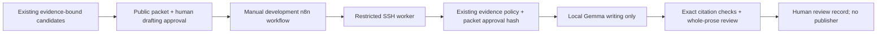

# Gemma drafting pilot — implementation and activation runbook

**Ready for review:** an inactive manual n8n workflow, an isolated Gemma worker,
public-evidence handoff, human review output, resource guards and rollback. No
workflow was imported, no SSH credential installed, no GPU rights extended, no
Gemma process started and no production route changed. The branch is preparation
only. Robert and Leigh's PR #21 blind drafts and score sheets are unchanged.

**Remaining decision:** after blind review, approve or decline a bounded manual
writing pilot using the measured partial-offload configuration. Approving the pilot
does not approve posts, autonomous topic qualification, a production model switch
or a recurring schedule. Actual SSH transport and live Gemma inference remain
activation checks; this preparation validates the contract and mocked integration.

## Model and route

The worker uses the **exact PR #21 Gemma 4 31B IT Q4_0 artifact**:

- Upstream `google/gemma-4-31B-it`; observed revision
  `842da3794eaa0b77d5f08bae87a17459d91ff475`.
- ggml-org conversion revision `4fa4fdf38bee237b5c9e8a5b4e72cf39404c9dcc`.
- `gemma-4-31B-it-Q4_0.gguf`, 17,992,313,088 bytes; SHA256
  `031dc1c5fa9c5a0abbf3c39c5173fb2af65f5ac2dc2a090268561d3c72dcd834`.
- llama.cpp SYCL `b86d2f07542b29ab099aed34fd6b6d1b2fd4b81c`, oneAPI 2025.3.2.
  Exact quantization input upstream commit remains unestablished; the artifact is pinned.

The new logical route is `linkedin-gemma-pilot`. n8n invokes a restricted SSH
command on `rigarashi@192.168.113.32`; the worker alone calls
`http://127.0.0.1:8017/v1/chat/completions`, served as `gemma4-31b`. No LAN model
listener, LiteLLM edit or home-chat fallback is introduced. The installed n8n
container already has OpenSSH and Node. Its SSH node does not expose host-key
pinning, so this workflow uses OpenSSH with `StrictHostKeyChecking=yes` and a
dedicated known-hosts file. Secrets stay outside Git.

Ubuntu lacked Node. Preparation installed a SHA256-checked, user-local Node
`v24.21.0` for the shared JavaScript evidence policy, with no system package or
container change. [node-runtime.json](node-runtime.json) pins the official archive
and MIT license reference. This is not an inference dependency download.

## Evidence and human approval



The production planner selects topics; this pilot does not replace that reasoning
stage. `prepare-request.cjs` selects an `evidence_bound` candidate by
`evidenceBundleId` from the existing candidate JSON and a separately written public
brief. It excludes transcript themes, private paths and cache metadata. It preserves
approved claim text, forms, attribution, all supplied source passages and IDs,
requested/final/canonical URLs, publishers, publication dates (or explicit null),
retrieval times, support judgments and source-origin judgments. It creates a
**pending** approval record, never approves its own packet.

Robert or Leigh must inspect that complete packet as public content, resolve webinar
overlap/current applicability, and set `approval.status` to `approved_for_drafting`,
`by` to `Robert` or `Leigh`, and `at` to an ISO timestamp. The digest binds the entire
brief/evidence packet to that approval; changed content requires a fresh review and
digest. This is an access-controlled human record, not a cryptographic identity
signature or automated privacy classification. No raw transcript is an allowed input.

Before loading Gemma, the worker runs the **existing `evidence/policy.cjs` unchanged**.
It requires exact passage bindings, all semantic dimensions, eligible sources and
resolved independence. The registered, claim-specific authoritative single-source
exception is preserved; a model cannot invent another exception. Missing required
text, conflicting qualifiers, unsupported numbers and unresolved origins block the
request. The source policy's semantic assessments remain fallible judgments.

Writing uses thinking disabled, temperature 0.8, top_p 0.95, seed 714919 and 2,048
output tokens, as in the evaluated writing path. Instructions preserve attribution,
scope and uncertainty; current news, evergreen guidance and historical background
are explicit. They remove the old brief's invitation to infer legal status. Exact
quotes remain separate from paraphrases. No client outcomes, first-person experience,
telemetry or legal claims may be invented.

Every output citation must reuse the selected approved claim's binding. The existing
whole-prose reviewer examines every sentence, including assertions omitted from the
writer's claim list. Unmapped prose goes to human review; it is not called false or
verified by lexical overlap. **Every draft requires human approval**, even when all
mechanical checks pass. `publicationApproval` stays null and
`automaticPublishingAllowed` stays false. There is no publication node or connection.

## Resource and queueing plan

| Setting | Prepared pilot | Basis / limitation |
|---|---|---|
| GPU placement | GPU0 only, 24/60 Gemma layers; no tensor split | Exact evaluated partial-offload placement |
| Context | 16,384; no context shift | Full packet plus output budget checked with native template/tokenizer before inference; oversized packets defer without trimming |
| CPU | Four generation and batch threads, nice 10 | Evaluated configuration; remaining weights in system RAM |
| Concurrency | One pilot job and one model slot | Locks also exclude the evaluation harness; concurrent submissions fail busy without inference |
| Admission | Home-chat and Comfy queues idle; ≥13 GiB free GPU0 and ≥58 GiB available RAM | Reserve 10 GiB additional GPU plus 3 GiB free; RAM allows measured process usage plus 32 GiB reserve |
| Runtime guards | ≤10 GiB additional GPU0, ≥3 GiB free GPU0, ≥32 GiB available RAM, GPU1 growth ≤512 MiB | Stop only the owned pilot process on violation or missing telemetry |
| Queue/time | Wait at most 10 minutes; 30-minute total job cap; 20-minute response timeout | No automatic retry, evidence truncation or production fallback |
| Household priority | Check before loading/calling and during work; cancel pilot when household/image activity appears | Five-second polling plus telemetry/network latency, not instantaneous preemption or a household latency guarantee |
| Idle footprint | Unload after each request, success or failure | No resident Gemma service between manual drafts |
| Access | Explicit private activation file, bounded to ≤2 hours; stop ≥60 seconds before its expiry | Cannot grant or extend GPU permissions; existing access rollback remains untouched |

PR #21 measured **8.728 GiB** peak incremental GPU0, **22.705 GiB** peak process RSS,
and **224.065 seconds median writing latency** for Gemma. Load-to-ready observations
were about 9–30 seconds. Four drafts would be roughly 15 minutes of median call time,
plus load/unload, queue waits and hashing; that is a planning estimate, not a measured
four-request pilot SLA. Full evidence or household activity may take longer or defer
work. Hashing the 18 GB artifact before each load is extra I/O and time, deliberately
not hidden in the old latency number.

**No production interruption is required for this partial-offload plan if current
headroom meets admission checks.** Insufficient headroom means defer. Do not evict
home-chat or ComfyUI. Full-GPU Gemma is not prepared for activation: releasing
home-chat's allocation would interrupt household chat and OMC intelligence and needs
an explicit coordinated maintenance window, recovery timer and queue hold. No such
window is requested or attempted here. Monday at 07:00 America/New_York remains the
production trigger; the research/planner clocks remain disabled.

## Saved incomplete-assessment diagnosis

No benchmark was repeated. [incomplete-audit.json](incomplete-audit.json) records
response hashes and case IDs derived from saved API responses and native run logs.

| Assessment outcome | home-chat | Qwen3.8-27B |
|---|---:|---:|
| API responses received | 36/36 | 36/36 |
| Output-budget exhaustion | 27 | 18 |
| Output tokens in every exhausted response | 3,072/3,072 | 3,072/3,072 |
| Transport timeouts / request runtime errors | 0 / 0 | 0 / 0 |
| Completed semantic decisions | 9 | 18 |
| Completed decisions with schema defects | 2 | 0 |

The incomplete replies all returned `finish_reason=length`; they did not time out.
They consumed the assessment budget including thinking before a final decision.
Home-chat's exhausted calls took **34.630–38.073 seconds**; Qwen's took
**633.936–781.085 seconds**, below the original 1,200-second client timeout. Partial
CPU/GPU offload accounts for slower Qwen execution, not a timeout classification.

Home-chat S12/S14 completed correct rejection decisions but returned an invalid
`claims[0].form` enum; these two schema failures are separate from the 27 unfinished
answers. Gemma completed all 36 decisions but had ten schema failures, also separate
from incompletion. Truncated JSON/parsing failures accompanying `length` are not
counted again as independent schema/runtime incidents.

Two earlier Qwen native-run records say `blocked` with child exit `-15`: these were
planned checkpoint/phase handoffs. Saved completed calls were retained and reused;
they are not 18 inference crashes. The retained native release logs show no context
truncation. Assessment enabled thinking, whereas home-chat production defaults to
thinking off. Saved S41 reasoning debates the ambiguous two-versus-three origin
instruction; that may consume budget but is not proven to explain all 45 failures.
Larger budgets or changed reasoning instructions remain untested. This writing pilot
does not silently alter production assessment settings or claim to solve that problem.

## Activation and rollback — only after the review decision

1. Approve a bounded manual pilot and verify fresh household/OMC availability and
   free resources. Keep the existing **8 October 20:51:03 UTC** device rollback and
   **20:52 UTC** confirmation/retry job intact. Do not reuse the expired lease as
   authorization. If later activation needs new temporary render access, use the
   existing narrow interactive helper after original ACL restoration, with its own
   automatic rollback; no Docker/socket/group/sudoers grant is required.
2. Deploy the reviewed pilot code on Ubuntu at its repository path. Keep the pinned
   Gemma file and llama build in the retained PR #21 private root. Verify paths and
   the Node dependency manifest. Create private state directory
   `/home/rigarashi/.local/share/linkedin-gemma-pilot` mode 0700. Copy
   `activation.example.json` there as `activation.json`, mode 0600, still disabled.
3. Install a dedicated pilot SSH key in n8n's private app storage as
   `/home/node/.n8n/gemma-pilot-ssh.key` (owner node, 0600). Pin Ubuntu's host key,
   independently checked against its local host public key, in
   `/home/node/.n8n/gemma-pilot-known-hosts`. Do not disable host verification.
   On Ubuntu restrict that public key using:

   ```text
   restrict,from="192.168.113.18",command="/usr/bin/python3 /home/rigarashi/projects/iggii-ai-stack/n8n/linkedin/gemma-pilot/worker.py --ssh" PUBLIC_KEY
   ```

   Verify the actual NAS source address before installation if networking changed.
   The forced worker accepts only `SSH_ORIGINAL_COMMAND=linkedin-gemma-pilot` and
   reads the public packet from stdin; no shell command or file path comes from it.
4. Create only the future pilot review folder, preserving established ownership
   `1000:1800`, directory 2770 and review/request files 0660. Install
   `write-review.cjs` in `/home/node/.n8n/gemma-pilot/` (technical app storage).
   Import `workflow.json` as a **new inactive development workflow**. Do not replace
   any existing workflow or connect it to the Monday chain.
5. Prepare the public request outside Git using `prepare-request.cjs`, then complete
   human drafting approval. Put that single request at the path below. Set the private
   activation file to enabled only after authorization, with approver, the pinned
   artifact digest and an ISO expiry within two hours and no later than GPU lease expiry.
   Run one manual workflow invocation. Unknown/busy/expired/resource failures defer;
   no retries are configured. Same request ID returns its saved checkpoint rather
   than generating again. A blocked attempt needs a new explicitly chosen request ID.
6. Open `<requestId>.draft.html` for the readable draft and frozen evidence; use `.review.json` for claims, source passages, attribution and all
   whole-prose flags. Save edits and a separate human approval record. Existing files
   are never overwritten with different content. No approval file is consumed by
   publication automation; this pilot has no publisher.

**Rollback:** run the following on Ubuntu to disable admission. The monitor notices
the change and terminates only its owned Gemma process; its finally block unloads
the model. The worker ignores SSH hangup while its bounded deadline monitor runs;
termination runs cleanup, and a Linux parent-death signal kills its native child if
the worker itself crashes. No process-name-wide kill or production container command
is used. Interrupted checkpoints are retained and not automatically retried.

```bash
python3 /home/rigarashi/projects/iggii-ai-stack/n8n/linkedin/gemma-pilot/worker.py --disable
```

Remove the dedicated SSH authorized-key entry and n8n pilot credential files, and
leave/delete only the new inactive development workflow as appropriate. Retain all
request, response, error and human review files. Let the authorized GPU ACL rollback
run and verify it using its existing mechanism. No production config restoration is
needed because the pilot does not change production routing, models or schedules.

## Exact paths and validation limits

| Item | Location |
|---|---|
| Prepared workflow | Repository `n8n/linkedin/gemma-pilot/workflow.json` — not imported |
| Future request in n8n | `/data/output/ias-linkedin/Reviews/Gemma-Pilot/request.json` |
| Future Windows review folder | `\\Iggy-Nas\Shared\ContentPipeline\output\ias-linkedin\Reviews\Gemma-Pilot` — not created during preparation |
| Future review files | `<requestId>.draft.html` and `<requestId>.review.json` in that folder |
| Private checkpoint/activation root | `/home/rigarashi/.local/share/linkedin-gemma-pilot` — no credentials/evidence in Git |
| Unchanged blind review and cleanup status | `\\Iggy-Nas\Shared\ContentPipeline\output\ias-linkedin\Reviews\Model-Comparison-20261007\START-HERE.html` and sibling `Access-Cleanup.txt` |

Focused offline checks exercise supported authoritative and corroborated cases,
unsafe evidence/approval/citation mutations, omitted prose assertions, incomplete
outputs, human-edit preservation, mocked n8n handoff, default-disabled activation
and resource guards. Prior PR #21 evidence, quotation and deployment checks are
reused. No model endpoint was called, no benchmark rerun, no pipeline/calendar test,
and no live SSH/model activation was attempted. These checks establish prepared
plumbing and fail-closed behavior, not a new measurement of writing quality or
household latency. Human blind-review results and the activation decision remain pending.
